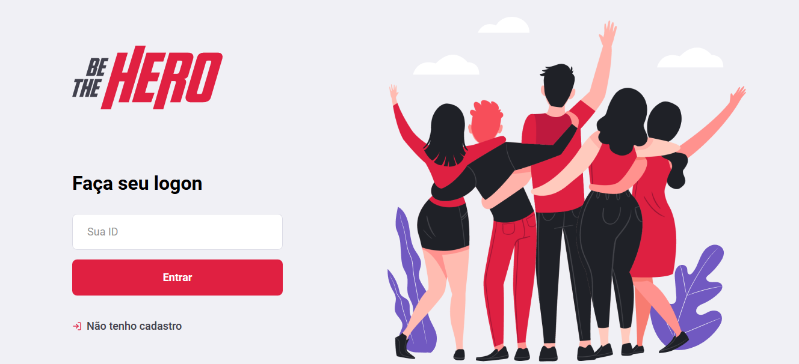
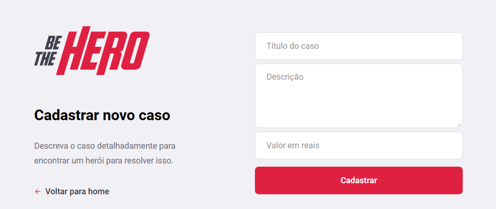
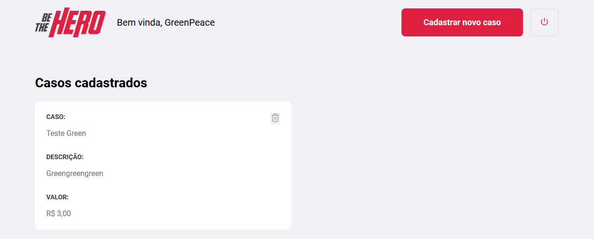

# BeTheHeroApp 🦸‍♂️ :rocket:
<h4 align="center">
 
 <b>Seja um verdadeiro Heroi!</b> 🦸‍♂️
</h4>

### App criado durante a semana OmniStack 11.0, uma aplicação completa do back ao front, feito com a Stack do Node.js e React

____________________________________________________________________________________________________________________________________
 

   
 

 

 
 

 

   
  

   
   ## Tecnologias Usadas </>:
   * JavaScript
   * Node.js
   * React
   * React Native
   * Expo 
   * SQLite
   ## :heart: Sobre a Aplicação: 
   O Be The Hero é uma plataforma criada para conectar ONG's com pessoas que queiram ajudar, 
   listando casos que as ONG's disponibilizam o Herói do dia pode ser **você** :heart_eyes: 🦸‍♂️ contribuindo 
   com um valor parcial ou integral do caso.
    
   
 
